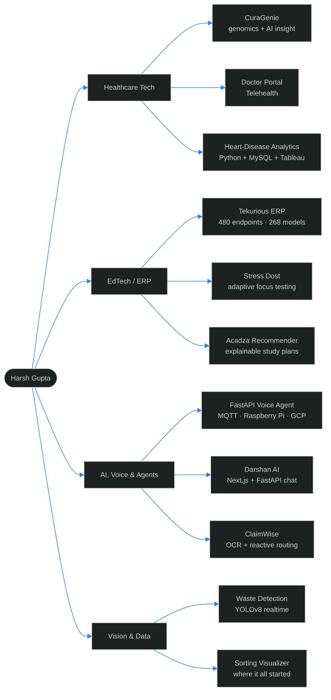

<!-- ═══════════════════════════════════════════════════════════════════════════
     HARSH GUPTA · GitHub Profile README
     Repo: github.com/harshguptakiet/harshguptakiet
     Every image endpoint here was live-tested. Dead services intentionally
     excluded: github-readme-stats (503), github-profile-trophy (402),
     github-contributor-stats (402).
     ═══════════════════════════════════════════════════════════════════════ -->

<div align="center">


<a href="https://cura-genie.vercel.app/"></a>
<a href="https://linkedin.com/in/harshguptakiet"></a>
<a href="mailto:guptasecularharsh@gmail.com"></a>


</div>

---

## `~$ whoami`

```console
harsh@github:~$ cat profile.json
{
  "name":     "Harsh Gupta",
  "role":     "Full-Stack Engineer · AI Systems Builder",
  "based_in": "Lucknow, Uttar Pradesh, India  (UTC+5:30)",
  "studying": "B.Tech Computer Science · KIET Group of Institutions",
  "shipping": ["Tekurious ERP", "CuraGenie", "Stress Dost", "ClaimWise"],
  "domains":  ["Healthcare Tech", "EdTech / ERP", "Voice & IoT", "Applied ML"],
  "stack":    ["TypeScript", "Python", "NestJS", "Next.js", "FastAPI", "PostgreSQL"],
  "status":   "open to roles · internships · collaborations"
}

harsh@github:~$ ls -la ~/work | tail -1
# 31 public repositories · ~14.8 MB tracked source · building since Nov 2024
```

I build **complete systems, not demos.** My repos lean into the unglamorous parts of software
that actually decide whether a product survives: multi-tenant schema design, auth and RBAC,
background jobs, real-time transport, OCR pipelines, and model-serving APIs.

Most of my work lives where **healthcare, education, and applied AI** overlap.

---

## 🧭 The Map



---

## 📊 GitHub Pulse

<div align="center">


**Contribution grid**


</div>

### By the numbers

<div align="center">

| 📦 Public repos | ⭐ Peak stars | � Peak forks | 💾 Tracked source | 📅 Building since |
|:---:|:---:|:---:|:---:|:---:|
| **31** | **6** · Cura-Genie | **22** · Cura-Genie | **~14.8 MB** | **Nov 2024** |

</div>

### Language distribution — measured from actual repository bytes

| Language | Share | | Where it lives |
|---|---:|---|---|
| **TypeScript** | `49.9%` | `████████████████████░░░░░░░░░░░░░░░░░░░░` | Tekurious ERP, CuraGenie, ClaimWise, Doctor Portal |
| **Python** | `20.6%` | `████████░░░░░░░░░░░░░░░░░░░░░░░░░░░░░░░░` | FastAPI services, Flask apps, ML pipelines |
| **Jupyter** | `13.4%` | `█████░░░░░░░░░░░░░░░░░░░░░░░░░░░░░░░░░░░` | Genomics work, model experimentation |
| **JavaScript** | `8.4%` | `███░░░░░░░░░░░░░░░░░░░░░░░░░░░░░░░░░░░░░` | Real-time frontends, visualizers |
| **HTML · CSS** | `6.2%` | `██░░░░░░░░░░░░░░░░░░░░░░░░░░░░░░░░░░░░░░` | Static builds, dashboards |
| **Vue · Shell · SQL · Docker** | `1.5%` | `█░░░░░░░░░░░░░░░░░░░░░░░░░░░░░░░░░░░░░░░` | Storefronts, deploys, migrations |

<div align="center">


</div>

---

## 🚀 Featured Work

> Six projects that best represent how I build. Every link below was tested and is live.

<table>
<tr>
<td width="50%" valign="top">

### 🏥 CuraGenie
**AI-powered healthcare & genomics platform**

`Next.js 15` · `FastAPI` · `TypeScript` · `Python` · `Docker`

Genomic data ingestion, ML-driven risk insight, and a patient-facing dashboard. My most
community-adopted project, with a companion notebook repo carrying the model research.

  

**[▶ Live demo](https://cura-genie.vercel.app/) · [Code](https://github.com/harshguptakiet/Cura-Genie) · [Notebooks](https://github.com/harshguptakiet/Cura_Genie)**

</td>
<td width="50%" valign="top">

### 🎓 Tekurious ERP
**Complete school-management platform — my largest build**

`NestJS` · `Prisma` · `PostgreSQL` · `Redis` · `Next.js`

A real enterprise system: multi-tenancy, RBAC, 2FA, device trust, timetabling, fees,
live classes, content delivery, analytics.

```yaml
API endpoints:    480
Database models:  268
Modules shipped:  17 / 17
Automated tests:  221 / 221  ✅
TypeScript:       ~4.0 MB
```

**[Code](https://github.com/harshguptakiet/tek_erp)**

</td>
</tr>
<tr>
<td width="50%" valign="top">

### 🧘 Stress Dost
**Focus testing that measures you under pressure**

`Flask` · `Socket.IO` · `OpenAI` · `SQLAlchemy` · `eventlet`

Instead of a quiet quiz, it *deliberately* stresses the user: bouncing questions,
spotlight effects, adaptive difficulty. Real-time scoring over WebSockets, AI-generated
question banks, per-session analytics.

 

**[Code](https://github.com/harshguptakiet/stress-dost) · [Web build](https://github.com/harshguptakiet/stress-dost-web)**

</td>
<td width="50%" valign="top">

### 📄 ClaimWise
**Insurance claims intelligence with reactive routing**

`TypeScript` · `Python` · `Pathway` · `OCR` · `Gemini`

Multi-document intake → OCR extraction → fraud / complexity / severity scoring →
rule-based routing. Pathway-backed streaming means a **rule change reassigns claims
without reprocessing anything.** Ships with a claim-aware chat assistant.

**[Code](https://github.com/harshguptakiet/claimwise)**

</td>
</tr>
<tr>
<td width="50%" valign="top">

### 🗣️ FastAPI Voice Agent
**MQTT voice assistants running on Raspberry Pi**

`FastAPI` · `MQTT` · `GCP` · `Raspberry Pi` · `Shell`

An IoT voice-toy platform: edge devices talk to a cloud LLM backend over MQTT, with
swappable domain bots, a full architecture spec, and a documented 15-minute deploy path.

**[Code](https://github.com/harshguptakiet/fastapi_voice_agent) · [v1 prototype](https://github.com/harshguptakiet/fastapi-voice)**

</td>
<td width="50%" valign="top">

### 🎯 Acadza Recommender
**An explainable study-plan engine**

`FastAPI` · `Python` · `Rule Engine`

Treated as a learning-system design problem, not a scoring script:

`Raw Data → Cleaning → Features → Insights → Rules → Plan → API`

Every recommendation traces back to the behavioural signal that triggered it — a digital
tutor that diagnoses before it prescribes.

**[Code](https://github.com/harshguptakiet/recommender_system)**

</td>
</tr>
</table>

---

## 🗂️ Full Repository Index — all 31

<details>
<summary><b>🏥 Healthcare & Life Sciences</b> · 7 repos</summary>

<br/>

| Repo | Stack | Highlight | |
|---|---|---|---|
| **Cura-Genie** | TypeScript · FastAPI | ⭐6 · 🍴22 — flagship platform | [Live](https://cura-genie.vercel.app/) |
| **Cura_Genie** | Jupyter · Python | ⭐2 — genomics notebooks & models | [Code](https://github.com/harshguptakiet/Cura_Genie) |
| **cura-g** | TypeScript · Python | Earlier architecture iteration | [Code](https://github.com/harshguptakiet/cura-g) |
| **doctor-portal** | TypeScript · Next.js | Practitioner console & scheduling | [Live](https://doctor-portal-v2l7-dywebukf6-harshguptakiets-projects.vercel.app/) |
| **telehealth** | TypeScript | Remote-consultation frontend | [Code](https://github.com/harshguptakiet/telehealth) |
| **disease-symptoms** | Python | Symptom → condition mapping | [Code](https://github.com/harshguptakiet/disease-symptoms) |
| **tableau-heart-disease** | Python · MySQL · Tableau · Flask | End-to-end risk-factor dashboard | [Code](https://github.com/harshguptakiet/tableau-heart-disease) |

</details>

<details>
<summary><b>🎓 EdTech, ERP & Learning Systems</b> · 5 repos</summary>

<br/>

| Repo | Stack | Highlight |
|---|---|---|
| **tek_erp** | NestJS · Prisma · PostgreSQL · Redis | 480 endpoints, 268 models, 221 tests green |
| **stress-dost** | Flask · Socket.IO · OpenAI | Real-time adaptive focus testing |
| **stress-dost-web** | Python · JavaScript | Web-optimised rebuild |
| **recommender_system** | FastAPI | Explainable, staged study recommendations |
| **Sorting-Visualizer** | JavaScript · CSS | ⭐2 — my first repo, still a clean teaching tool |

</details>

<details>
<summary><b>🤖 AI, Voice & Agents</b> · 4 repos</summary>

<br/>

| Repo | Stack | Highlight |
|---|---|---|
| **fastapi_voice_agent** | FastAPI · MQTT · GCP | IoT voice toys on Raspberry Pi |
| **fastapi-voice** | Python · FastAPI | ⭐1 — first voice-pipeline prototype |
| **darshan-ai** | Next.js · FastAPI | Dual-app chatbot workspace · [Live](https://darshan-ai-liart.vercel.app/) |
| **claimwise** | TypeScript · Python · Pathway | ⭐1 — OCR + ML claims routing, Gemini chat |

</details>

<details>
<summary><b>🌍 Computer Vision & Social Impact</b> · 3 repos</summary>

<br/>

| Repo | Stack | Highlight |
|---|---|---|
| **waste-detection-main** | YOLOv8 · Streamlit | ⭐2 — live webcam sorting: recyclable / non-recyclable / hazardous |
| **swachh-yatra** | HTML · CSS | ⭐2 — civic cleanliness awareness build |
| **quantum-computing** | React | ⭐2 — quantum-concept explainer app |

</details>

<details>
<summary><b>🛠️ Tools, Web & Foundations</b> · 10 repos</summary>

<br/>

| Repo | Stack | Highlight |
|---|---|---|
| **resume-generator** | Python · Streamlit | ⭐1 — AI-assisted resume builder · [Live](https://resume-generator-hdzstpyjs9rx3bpptsszlq.streamlit.app/) |
| **qr-gen** | JavaScript | ⭐1 — zero-dependency QR generator · [Live](https://qr-generator-webcode.netlify.app/) |
| **tanishq** | Vue 3 · Vite | ⭐1 — jewellery storefront · [Live](https://tanishq-wine.vercel.app/) |
| **feedback-frontend** | JavaScript | ⭐2 — client half of a full-stack feedback loop |
| **feedback-backend** | Python | ⭐2 — API half, split cleanly |
| **python-projects** | Python | ⭐2 — scripting & automation collection |
| **bookstore** | HTML | ⭐2 — early frontend fundamentals |
| **my-contribution** | Python | ⭐2 — open-source contribution work |
| **PRACTICAL** | JavaScript | ⭐2 — coursework and practice |
| **harshguptakiet** | Markdown | ⭐2 — this profile |

</details>

<details>
<summary><b>🤝 Open Source Contributions</b> · 2 repos</summary>

<br/>

| Project | What it is |
|---|---|
| **[eventyay](https://github.com/harshguptakiet/eventyay)** | FOSSASIA — open-source event management, ticketing, talks & video |
| **strees_dost_web_system** | Collaborative fork of the Stress Dost web system |

</details>

---

## 🧰 Tech Arsenal

<div align="center">

**Languages**


**Frontend**


**Backend & APIs**


**Data & Infrastructure**


**Cloud, ML & Tooling**


</div>

| Layer | Comfortable shipping | Actively deepening |
|---|---|---|
| **Frontend** | React, Next.js App Router, TypeScript, Tailwind, state management | Server Components, streaming UI, a11y depth |
| **Backend** | NestJS, FastAPI, Flask, Express, REST design, auth & RBAC | Event-driven architecture, queues at scale |
| **Data** | PostgreSQL, Prisma, MySQL, MongoDB, Redis, schema modelling | Query planning, partitioning, pgvector |
| **AI / ML** | OpenAI & Gemini APIs, YOLOv8, OCR, RAG pipelines | Fine-tuning, eval harnesses, guardrails |
| **DevOps** | Docker, GitHub Actions, Vercel, GCP, Render | Kubernetes, observability, infra-as-code |

---

## 🔭 Current Focus

<table>
<tr>
<td width="50%" valign="top">

### Building right now

```yaml
Tekurious ERP:
  - remaining FR coverage → 100%
  - hardening auth: 2FA, device trust,
    session policy, suspicious activity
  - analytics & reporting module

CuraGenie v2:
  - richer genomic risk models
  - real-time consultation layer

ClaimWise:
  - wider OCR document coverage
  - reactive routing benchmarks
```

</td>
<td width="50%" valign="top">

### Learning deliberately

```yaml
Now:
  - distributed systems & event sourcing
  - PostgreSQL internals + query tuning
  - LLM evaluation and guardrails
  - Kubernetes, platform observability

Next:
  - Go for high-throughput services
  - Rust for systems fundamentals
  - large-scale system design
```

</td>
</tr>
</table>

---

## 📈 The Journey

```text
Nov 2024   ●  First commits — Sorting Visualizer, Bookstore, Swachh Yatra
           │  Learning the web from first principles
2025 Q1-Q2 ●  Python, ML and full-stack fundamentals
           │  Feedback platform · Waste Detection (YOLOv8) · Quantum explainer
Aug 2025   ●  CuraGenie begins — healthcare becomes the focus
           │  Grew to 6 stars and 22 forks; taught me real architecture
Sep 2025   ●  Healthcare cluster: Doctor Portal, Telehealth, Resume Generator
Nov 2025   ●  ClaimWise — OCR, ML scoring, reactive streaming routing
2026 Q1-Q2 ●  Voice + IoT over MQTT · Darshan AI · Acadza Recommender
Jul 2026   ●  Tekurious ERP — 480 endpoints, 268 models, enterprise scale
Today      ●  Still shipping. 31 repos, ~14.8 MB of source, no filler.
```

<div align="center">

<picture>
  <source media="(prefers-color-scheme: dark)" srcset="https://raw.githubusercontent.com/harshguptakiet/harshguptakiet/output/github-contribution-grid-snake-dark.svg"/>
  <source media="(prefers-color-scheme: light)" srcset="https://raw.githubusercontent.com/harshguptakiet/harshguptakiet/output/github-contribution-grid-snake.svg"/>
  
</picture>

</div>

---

## 🤝 Let's Work Together

<div align="center">

| 📍 Location | 🕐 Timezone | 💼 Status | ⏱️ Reply time |
|:---:|:---:|:---:|:---:|
| Lucknow, India | IST · UTC+5:30 | 🟢 Open to opportunities | Under 24 hours |

**Looking for** · Full-Stack / Backend Engineer roles · internships · healthcare & EdTech collaborations

**Open to** · Remote · Hybrid · On-site · Contract

<a href="mailto:guptasecularharsh@gmail.com"></a>
<a href="https://linkedin.com/in/harshguptakiet"></a>
<a href="https://github.com/harshguptakiet?tab=repositories"></a>

<br/>


<sub>Every number on this page comes from the GitHub API and my actual repository contents. No filler.</sub>

</div>
